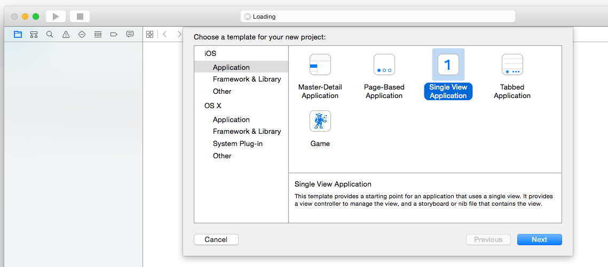
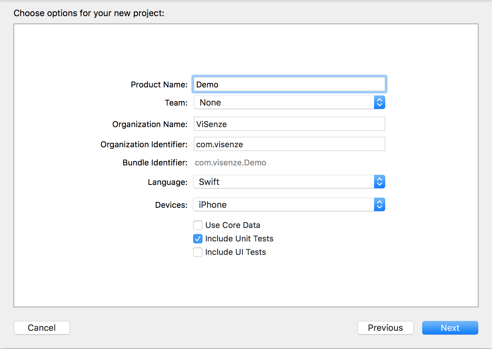
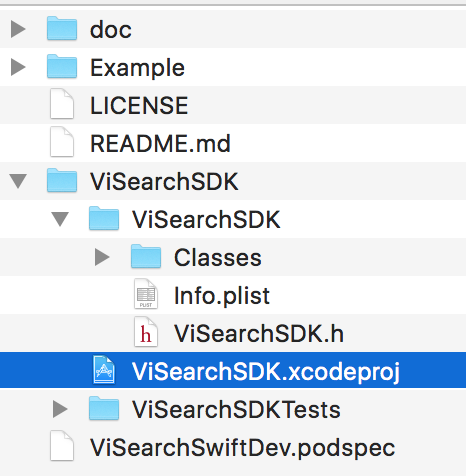
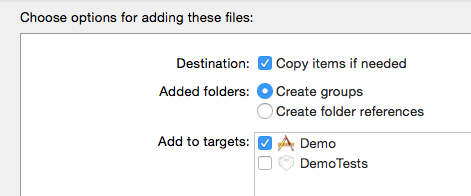

# ViSearch Swift SDK and Demo Source Code


---

## Table of Contents

- [ViSearch Swift SDK and Demo Source Code](#visearch-swift-sdk-and-demo-source-code)
  - [Table of Contents](#table-of-contents)
  - [1. Overview](#1-overview)
  - [2. Setup](#2-setup)
    - [2.1 Set up Xcode project](#21-set-up-xcode-project)
    - [2.2 Import ViSearch Swift SDK](#22-import-visearch-swift-sdk)
      - [2.2.1 Using CocoaPods](#221-using-cocoapods)
      - [2.2.2 Using Swift Package Manager](#222-using-swift-package-manager)
      - [2.2.3 Using Carthage](#223-using-carthage)
      - [2.2.4 Using Manual Approach](#224-using-manual-approach)
    - [2.3 Add Privacy Usage Description](#23-add-privacy-usage-description)
  - [3. Initialization](#3-initialization)
    - [3.1 ViSearch (Deprecated)](#31-visearch-deprecated)
    - [3.2 ProductSearch](#32-productsearch)
      - [3.2.1 Setup for multiple placements](#321-setup-for-multiple-placements)
  - [4. Solution APIs](#4-solution-apis)
    - [4.1 ViSearch (Deprecated)](#41-visearch-deprecated)
    - [4.2 ProductSearch](#42-productsearch)
      - [4.2.1 Search By Image](#421-search-by-image)
      - [4.2.2 Recommendations](#422-recommendations)
      - [4.2.3 Multisearch](#423-multisearch)
      - [4.2.4 Multisearch autocomplete](#424-multisearch-autocomplete)
      - [4.2.5 Multisearch complementary](#425-multisearch-complementary)
      - [4.2.6 Multisearch outfit recommendations](#426-multisearch-outfit-recommendations)
  - [5. Search Results](#5-search-results)
    - [5.1 ViSearch (Deprecated)](#51-visearch-deprecated)
    - [5.2 ProductSearch](#52-productsearch)
  - [6. Event Tracking](#6-event-tracking)
    - [6.1 Setup Tracking](#61-setup-tracking)
      - [6.1.1 Setup for multiple placements](#611-setup-for-multiple-placements)
    - [6.2 Send Events](#62-send-events)
  - [7. Developer Notes](#7-developer-notes)

---

## 1. Overview

This SDK contains two sets of APIs that provide accurate, reliable and scalable search. Please use **ProductSearch** API for current latest version.

It is an open source software to provide easy integration of ViSearch APIs and ProductSearch APIs with your iOS applications. See the table below for more API specific information:

|API|Description|
|---|---|
|**ViSearch**| Four search methods are provided based on the ViSearch legacy Solution APIs (**Deprecated**) - [*Find Similar*](), [*You May Also Like*](), [*Search By Image*]() and [*Search By Color*](). For more details, see [ViSearch API Documentation](http://www.visenze.com/docs/overview/introduction).|
|**ProductSearch**| Rezolve Discovery Suite provides your customers a better and more intuitive product search and discovery experience by helping them search, navigate and interact with products more easily. The ProductSearch API provides a new set of product-based APIs that work with Rezolve Catalog Manager. In the SDK, ProductSearch API is refered to as `ViProductSearch`.|

For source code and references, please visit the [Github Repository](https://github.com/visenze/visearch-sdk-swift).

> Current stable version: `1.12.1` (Swift 5+)
>
> Supported iOS version: iOS 8.x and higher

## 2. Setup

### 2.1 Set up Xcode project

In Xcode, go to File > New > Project Select the Single View Application.



Type a name for your project and press Next, here we use Demo as the project name.



### 2.2 Import ViSearch Swift SDK

#### 2.2.1 Using CocoaPods

First you need to install the CocoaPods Ruby gem:

```sh
# Xcode 7 + 8
sudo gem install cocoapods --pre
```

Then go to your project directory to create an empty Podfile

```sh
cd /path/to/Demo
pod init
```

Edit the Podfile as follow. Please update the version to the latest.
This is just a reference.

```sh
platform :ios, '12.0'
use_frameworks!

target '<Your Target Name>' do
    pod 'ViSearchSDK', '~>1.12.1'
end
...
```

Install the ViSearch SDK:

```sh
pod install
```

The Demo.xcworkspace project should be created.

#### 2.2.2 Using Swift Package Manager

You can add ViSearchSDK to an Xcode project by adding it to your project as a package.

> https://github.com/visenze/visearch-sdk-swift

If you want to use Dependencies in a [SwiftPM](https://swift.org/package-manager/) project, it's as
simple as adding it to your `Package.swift`:

``` swift
dependencies: [
  .package(url: "https://github.com/visenze/visearch-sdk-swift", from: "1.12.1")
]
```

And then adding the product to any target that needs access to the library:

```swift
.product(name: "ViSearchSDK", package: "visearch-sdk-swift"),
```

#### 2.2.3 Using Carthage

1. Create a Cartfile in the same directory where your `.xcodeproj` or `.xcworkspace` is.
2. List the dependency as follow: `github "visenze/visearch-sdk-swift" ~> 1.12.1` . Please change the version to latest available version.
3. Run `carthage update --use-xcframeworks` or `carthage bootstrap --platform iOS --cache-builds --no-use-binaries --use-xcframeworks` . The command will fail as `ViSenzeAnalytics.xcframework` is not pulled as it is a dependency. We will resolve it in the next step.
4. A Cartfile.resolved file and a Carthage directory will appear in the same directory where your .xcodeproj or .xcworkspace is
5. Navigate to ViSearchSDK folder:  `cd Carthage/Checkouts/visearch-sdk-swift/ViSearchSDK` which contains the source code for ViSearchSDK.
6. Run `carthage update --use-xcframeworks` or `carthage bootstrap --platform iOS --cache-builds --no-use-binaries --use-xcframeworks` . This will pull and build Analytics dependency.
7. Return to the root directory where your `.xcodeproj` or `.xcworkspace` is.
8. Run the carthage command again (same as step 3).
9. The build will be successful.
10. Drag the built `ViSearchSDK.xcframework`/ `ViSenzeAnalytics.framework` bundles from Carthage/Build into the "Frameworks and Libraries" section of your application’s Xcode project.
11. If you are using Carthage for an application, select "Embed & Sign", otherwise "Do Not Embed".

#### 2.2.4 Using Manual Approach

You can also download the iOS [ViSearch SDK](https://github.com/visenze/visearch-sdk-swift/archive/master.zip) directly. To use it, unzip it and drag ViSearchSDK project (under ViSearchSDK folder) into your project. The ViSearchSDK project produces ViSearchSDK framework and has a dependency i.e. ViSenzeAnalytics. Before it can be used, you will need to run and pull ViSenzeAnalytics framework by running:

```sh
carthage update --use-xcframeworks
```

To verify the ViSearchSDK project can be compiled successfully, open `ViSearchSDK.xcodeproj` , make sure it can be built successfully and `ViSenzeAnalytics` framework is included under Frameworks and Libraries. If for some reasons, the framework is missing, you can also find it under `ViSearchSDK/Carthage/Build/ViSenzeAnalytics.xcframework` path. You can manually add the framework to the project if missing.

After this, you can copy the ViSearchSDK folder into your project.



- Open the `ViSearchSDK` folder, and drag the `ViSearchSDK.xcodeproj` into the Project Navigator of your application's Xcode project.

    > It should appear nested underneath your application's blue project icon. Whether it is above or below all the other Xcode groups does not matter.

    

- Select the `ViSearchSDK.xcodeproj` in the Project Navigator and verify the deployment target matches that of your application target.
- Next, select your application project in the Project Navigator (blue project icon) to navigate to the target configuration window and select the application target under the "Targets" heading in the sidebar.
- In the tab bar at the top of that window, open the "General" panel.
- Click on the `+` button under the "Embedded Binaries" section.
- Select the `ViSearchSDK.framework`.

> The `ViSearchSDK.framework` is automagically added as a target dependency, linked framework and embedded framework.

You are done!

### 2.3 Add Privacy Usage Description

iOS 10 now requires user permission to access camera and photo library. If your app requires these access, please add description for NSCameraUsageDescription, NSPhotoLibraryUsageDescription in the Info.plist. More details can be found [here](https://developer.apple.com/library/content/documentation/General/Reference/InfoPlistKeyReference/Articles/CocoaKeys.html#//apple_ref/doc/uid/TP40009251-SW24).

## 3. Initialization

### 3.1 ViSearch (Deprecated)

> **Deprecated.** See the [ViSearch Legacy API documentation](doc/visearch-legacy-api.md) for initialization details.

### 3.2 ProductSearch

`ProductSearch` **must** be initialized with an `appKey` and `placementId` **before** it can be used. 

For Azure apps, please set the baseUrl to `https://multimodal.search.rezolve.com`. For AWS apps please set the baseUrl to `https://search.visenze.com`

```swift
import ViSearchSDK

// initialize ProductSearch API using app key and placement id
ViProductSearch.sharedInstance.setUp(appKey: "YOUR_KEY", placementId: YOUR_PLACEMENT_ID)

// custom search endpoint
ViProductSearch.sharedInstance.setUp(appKey: "YOUR_KEY", placementId: YOUR_PLACEMENT_ID, baseUrl:"https://multimodal.search.rezolve.com")

// configure timeout to 30s example. By default timeout is set 10s.
ViProductSearch.sharedInstance.client?.timeoutInterval = 30
ViProductSearch.sharedInstance.client?.sessionConfig.timeoutIntervalForRequest = 30
ViProductSearch.sharedInstance.client?.sessionConfig.timeoutIntervalForResource = 30
ViProductSearch.sharedInstance.client?.session = URLSession(configuration: (ViProductSearch.sharedInstance.client?.sessionConfig)!)


```

#### 3.2.1 Setup for multiple placements

If you want to create multiple instances of ProductSearch, you can instantiate ViProductSearch multiple times

```swift
var placement111 = ViProductSearch()
placement111.setUp(appKey: "YOUR_KEY", placementId: YOUR_PLACEMENT_ID)

var placement222 = ViProductSearch()
placement222.setUp(appKey: "YOUR_KEY", placementId: YOUR_PLACEMENT_ID)
```

## 4. Solution APIs

### 4.1 ViSearch (Deprecated)

> **Deprecated.** See the [ViSearch Legacy API documentation](doc/visearch-legacy-api.md) for the full API reference, including Visually Similar Recommendations, Search by Image, Search by Color, and Multiple Products Search.

### 4.2 ProductSearch

#### 4.2.1 Search By Image

POST /v1/product/search_by_image

Searching by Image can be done with 3 different parameters - image URL, image ID, image File.

* Using Image URL

```swift
import ViSearchSDK
...
let params = ViSearchByImageParam(imUrl: "IMAGE_URL")
```

* Using Image ID (the ID can be retrieved from previous search responses)

```swift
import ViSearchSDK
...
let params = ViSearchByImageParam(im_id: "IMAGE_ID")
```

* Using an Image File (UIImage)

```swift
import ViSearchSDK
...
let params = ViSearchByImageParam(image: UIImage(contentsOfFile: "IMAGE_FILEPATH"))
```

Running the search:

```swift
ViProductSearch.sharedInstance.searchByImage(
    params: params,
    successHandler: { 
        (response: ViProductSearchResponse?) -> Void in
        // your function to process response
    },
    failureHandler: {
        (err: Error) -> Void in 
        // your function to handle error
    }
)
```

#### 4.2.2 Recommendations

GET /v1/product/recommendations/{product-id}

```swift
import ViSearchSDK
...
let params = ViSearchByIdParam(productId: "PRODUCT_ID")

ViProductSearch.sharedInstance.searchById(
    successHandler: { 
        (response: ViProductSearchResponse?) -> Void in
        // your function to process response
    },
    failureHandler: {
        (err: Error) -> Void in 
        // your function to handle error
    }
)
```

#### 4.2.3 Multisearch

POST /v1/product/multisearch

```swift
import ViSearchSDK
...
let params = ViSearchByImageParam(image: UIImage(contentsOfFile: "IMAGE_FILEPATH"))

params.q = "my-text-query"

ViProductSearch.sharedInstance.multisearch(
    params: params,
    successHandler: { 
        (response: ViProductSearchResponse?) -> Void in
        // your function to process response
    },
    failureHandler: {
        (err: Error) -> Void in 
        // your function to handle error
    }
)
```

#### 4.2.4 Multisearch autocomplete

POST /v1/product/multisearch/autocomplete

```swift
import ViSearchSDK
...
let params = ViSearchByImageParam(image: UIImage(contentsOfFile: "IMAGE_FILEPATH"))

params.q = "my-partial-text-query"

ViProductSearch.sharedInstance.multiSearchAutoComplete(
    params: params,
    successHandler: { 
        (response: ViAutoCompleteResponse?) -> Void in
        // your function to process response
    },
    failureHandler: {
        (err: Error) -> Void in 
        // your function to handle error
    }
)
```

#### 4.2.5 Multisearch Complementary

POST /v1/product/multisearch/complementary

```swift
import ViSearchSDK
...
let params = ViSearchByImageParam(image: UIImage(contentsOfFile: "IMAGE_FILEPATH"))

params.q = "my-text-query"

ViProductSearch.sharedInstance.multiSearchComplementary(
    params: params,
    successHandler: { 
        (response: ViProductSearchResponse?) -> Void in
        // your function to process response
    },
    failureHandler: {
        (err: Error) -> Void in 
        // your function to handle error
    }
)
```

#### 4.2.6 Multisearch Outfit Recommendations

POST /v1/product/multisearch/outfit-recommendations

```swift
import ViSearchSDK
...
let params = ViSearchByImageParam(image: UIImage(contentsOfFile: "IMAGE_FILEPATH"))

params.q = "my-text-query"

ViProductSearch.sharedInstance.multiSearchOutfitRec(
    params: params,
    successHandler: { 
        (response: ViProductSearchResponse?) -> Void in
        // your function to process response
    },
    failureHandler: {
        (err: Error) -> Void in 
        // your function to handle error
    }
)
```


## 5. Search Results

`ViSearch` and `ProductSearch` each have their own responses, but they share many similarities, more details can be found in this section.

### 5.1 ViSearch (Deprecated)

> **Deprecated.** See the [ViSearch Legacy API documentation](doc/visearch-legacy-api.md#3-search-results) for response details.

### 5.2 ProductSearch

After a successful search request, the result is passed to the callback function in the form of **ViProductSearchResponse**.  You can use the following properties from the result to fulfill your own purpose.

|Name|Type|Description|
|---|---|---|
|requestId|String|Same as ViSearch|
|status|String|The request status, either “OK”, “warning”, or “fail”|
|imageId|String|Image ID. Can be used to search again without reuploading|
|page|Int|The result page number|
|limit|Int|The number of results per page|
|total|Int|Total number of search result.|
|error|ViErrorMsg|Error message and code if the request was not successful i.e. when status is “warning” or “fail”|
|productTypes|[ViProductType]|Detected product types and their bounding box in (x1,y1,x2,y2) format|
|result|[ViProduct]|The list of products in the search results. Important fields for first release. If missing, it will be set to blank. Note that we are displaying customer’s original catalog fields in “data” field|
|catalogFieldsMapping|[String:String]|Original catalog’s fields mapping|
|facets|[ViFacet]|List of facet fields value and response for filtering|
|productInfo|[String:Any]|Only applicable for VSR, return query product info|
|objects|[ViProductObjectResult]| |
|groupResults|[ViGroupResult]|Only applicable when group_by is set|
|groupByKey|String|Only applicable when group_by is set|
|querySysMeta|[String:String]|System meta for query image / product|

## 6. Advanced Search Parameters

> **Deprecated (ViSearch only).** See the [ViSearch Legacy API documentation](doc/visearch-legacy-api.md#4-advanced-search-parameters) for metadata retrieval, filtering, result scoring, object recognition, and facets filtering.


## 6. Event Tracking

To improve search performance and gain useful data insights, it is recommended to send user interactions (actions) with our visual search results. 

### 6.1 Setup Tracking

You can initiliase Rezolve tracker as follows depending on whether you are using new Rezolve Console (ms.console.rezolve.com) or Rezolve Dashboard (dashboard.visenze.com). 

```swift
import ViSearch

...

# for Rezolve Console
let tracker = ViProductSearch.sharedInstance.newTracker()

# for Rezolve old dashboard
let tracker = ViSearch.sharedInstance.newTracker(code: "your-code")

```

To get Rezolve autogenerated `uid` and session Id for analytics purposes, you can call

```swift
// get uid
ViProductSearch.sharedInstance.getUid()

// get session ID
ViProductSearch.sharedInstance.getSid()

```

#### 6.1.1 Setup for multiple placements

If you want to create multiple instances of tracker, you can instantiate ViSenzeTracker multiple times

```swift
var placement111 = ViProductSearch()
placement111.setUp(appKey: "YOUR_KEY", placementId: YOUR_PLACEMENT_ID)
var tracker111 = placement111.newTracker()

var placement222 = ViProductSearch()
placement222.setUp(appKey: "YOUR_KEY", placementId: YOUR_PLACEMENT_ID)
var tracker222 = placement222.newTracker()
```

### 6.2 Send Events

Currently we support the following event actions: `click`, `view`, `product_click`, `product_view`, `add_to_cart`, `add_to_wishlist` and `transaction`. The `action` parameter can be an arbitrary string and custom events can be sent.

Note that it is optional to send transaction ID, product image URL and product position. You can create the event using the corresponding methods such as `VaEvent.newProductClickEvent (queryId: "", pid: "")` if you do not have other fields.

To send events, first retrieve the search query ID found in the search results call back:

```swift

successHandler: {
                    (data : ViResponseData?) -> Void in
                       if let data = data {
                           let queryId = data.reqId
                       }

}

``` 

Then the linked events can be sent as follows:


```swift
# send product click
let productClickEvent = VaEvent.newProductClickEvent(queryId: "ViSearch reqid in API response", pid: "product ID", imgUrl: "product image URL", pos: 3)
tracker.sendEvent(productClickEvent) { (eventResponse, networkError) in
   
}

# send product impression
let impressionEvent = VaEvent.newProductImpressionEvent(queryId: "ViSearch reqid in API response", pid: "product ID", imgUrl: "product image URL", pos: 3)
tracker.sendEvent(impressionEvent)

# send Transaction event e.g order purchase of $300
let transEvent = VaEvent.newTransactionEvent(queryId: "xxx", transactionId:"your trans id", value: 300)
tracker.sendEvent(transEvent)

# send Add to Cart Event
let add2Cart = VaEvent.newAdd2CartEvent(queryId: "ViSearch reqid in API response", pid: "product ID", imgUrl: "product image URL", pos: 3)
tracker.sendEvent(add2Cart)

# send result load event
let resLoadEvent = VaEvent.newResultLoadEvent(queryId: "xxx", pid:"your query product id")
tracker.sendEvent(resLoadEvent)
 
```

User action(s) can also be sent through an batch event handler.

A common use case for this batch event method is to group up all transactions by sending it in a batch. This SDK will automatically generate a transaction ID to group transactions as an order.

```swift
tracker.sendEvents(eventList)
```

Below are the brief description for various parameters:

Field | Description | Required
--- | --- | ---
queryId| The request id of the search request. This reqid can be obtained from the search response handler:```ViResponseData.reqId``` | Yes
action | Event action. Currently we support the following event actions: `click`, `view`, `product_click`, `product_view`, `add_to_cart`, and `transaction`. | Yes
pid | Product ID ( generally this is the `im_name`) for this product. Can be retrieved via `ViImageResult.im_name` | Required for product view, product click and add to cart events
imgUrl | Image URL ( generally this is the `im_url`) for this product. Can be retrieved via `ViImageResult.im_url ` | Required for product view, product click and add to cart events
pos | Position of the product in Search Results e.g. click position/ view position. Note that this start from 1 , not 0. | Required for product view, product click and add to cart events
transactionId | Transaction ID | Required for transaction event.
value | Transaction value e.g. order value | Required for transaction event.
uid | Unique user/device ID. If not provided, a random (non-personalizable) UUID will be generated to track the browser. | No
category | A generic string to categorize / group the events in related user flow. For example: `privacy_flow`, `videos`, `search_results`. Typically, categories are used to group related UI elements. Max length: 32 | No
name | Event name e.g. `open_app` , `click_on_camera_btn`. Max length: 32. | No
label | label for main interaction object such as product title, page title. This together with `action` can be used to decide whether an event is unique e.g. if user clicks on same product twice, only 1 unique click . Max length: 32. | No
fromReqId | Generic request ID field to specify which request leads to this event e.g. click request ID that leads to the purchase. The chain can be like this queryId → clickId → purchase. Max length: 32. | No
source | Segment the traffic by tagging them e.g. from camera, from desktop. Max length: 32. | No
brand | Product brand. Max length: 64. | No
price | Product price. Numeric field, if provided must be >=0 and is a valid number. | No
currency | ISO 3 characters code e.g. “USD”. Will be validated if provided. | No
productUrl| Product URL. Max length: 512 | No
campaign | Advertising campaign. Max length : 64. | No
adGroup | Ad group name (only relevant for campaign) | No
creative | Creative name (only relevant for campaign) | No
n1 | Custom numeric parameter. | No
n2 | Custom numeric parameter. | No
n3 | Custom numeric parameter. | No
n4 | Custom numeric parameter. | No
n5 | Custom numeric parameter. | No
s1 | Custom string parameter. Max length: 64. | No
s2 | Custom string parameter. Max length: 64. | No
s3 | Custom string parameter. Max length: 64. | No
s4 | Custom string parameter. Max length: 64. | No
s5 | Custom string parameter. Max length: 64. | No
json | Custom json parameter. Max length: 512. | No


## 7. Developer Notes

The SDK requires Rezolve Tracking library as a dependency [https://github.com/visenze/visenze-tracking-swift](https://github.com/visenze/visenze-tracking-swift). For local development, the dependency can be pulled by running the following within `ViSearchSDK` folder.

```
# first update version within Cartfile

# pull latest changes and build framework
carthage update --use-xcframeworks
```
